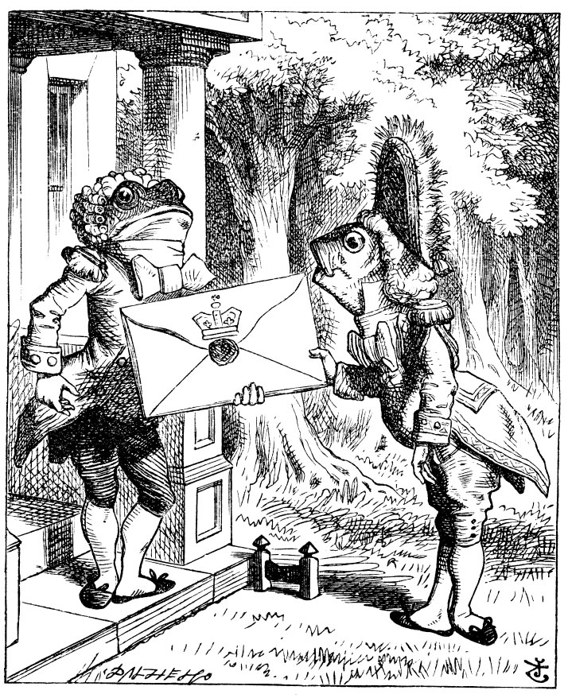

## Introduction

A good Table is sometimes far more effective than a chart or visual! 

## References

1. Albert Rapp, *Creating Beautiful Tables in R with `{gt}`* <https://gt.albert-rapp.de/>

1. 

