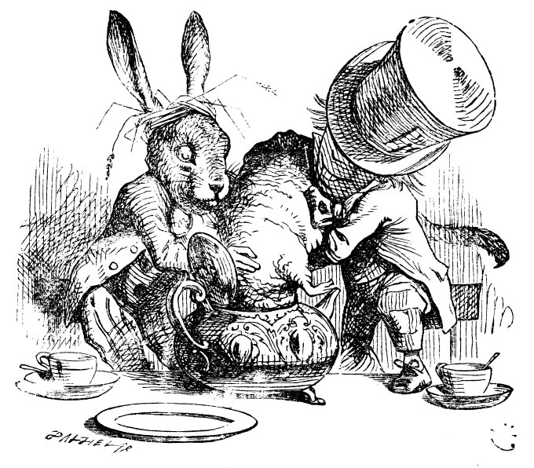

## Introduction

There are very many great JavaScript libraries for creating eye-popping and even interactive charts! And these are now available in R, and can be invoked using R code! So we can "use JavaScript" in R, as it were, without knowing JavaScript! And create something like this:


<br>

```{r, echo=FALSE,eval=FALSE,warning=FALSE,message=FALSE}
library(tidyverse)
library(echarts4r)
library(echarts4r.assets)
url <- "https://echarts.apache.org/examples/data-gl/asset/data/population.json"
data <- jsonlite::fromJSON(url)
data <- as.data.frame(data)
names(data) <- c("lon", "lat", "value")

data |> 
  e_charts(lon) |> 
  e_globe(
    environment = ea_asset("starfield"),
    base_texture = ea_asset("world topo"), 
    height_texture = ea_asset("world topo"),
    displacementScale = 0.04
  ) |> 
  e_bar_3d(lat, value, coord_system = "globe") |> 
  e_visual_map(show = FALSE)
```


Unlike the Dormouse, no complaints!

We will explore a few them, as an alternative to `ggplot` !!

This may be too much of a good thing, or `a much of muchness` but then, we can always use  more then one way of telling our stories!!


## References

1. Bring the best of JavaScript data visualization to R, <https://www.htmlwidgets.org/>


2. https://patchwork.data-imaginist.com/

