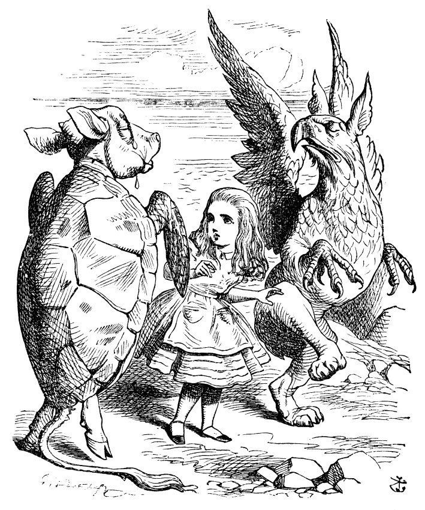

## Introduction

We will spend a little time wrapping up everything that we have learnt so far, in R.

We will take one large dataset that has numerical, spatial and network type data, and see how we can make multiple visual depictions of it. We will use most of the packages that we have encountered so far and try to make a polished info visualization with all the graphs, text, and descriptions put together!

## References

