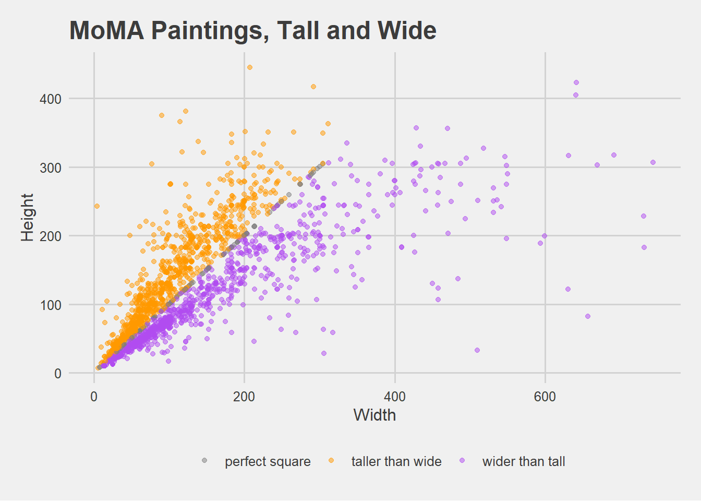
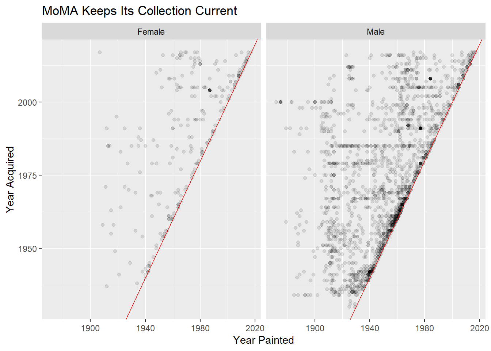
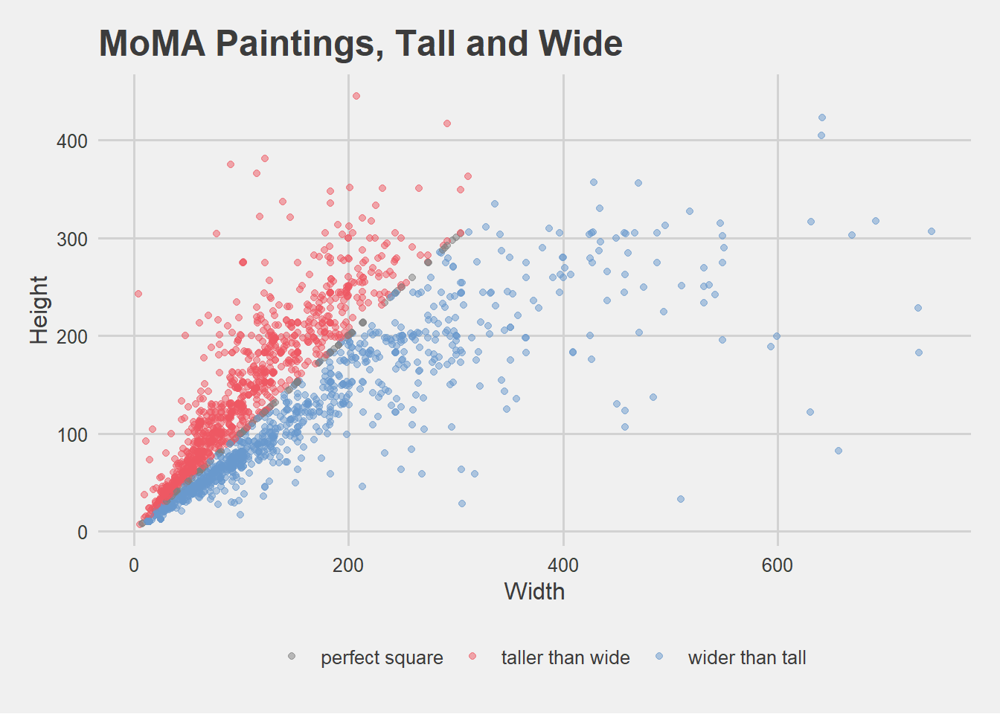
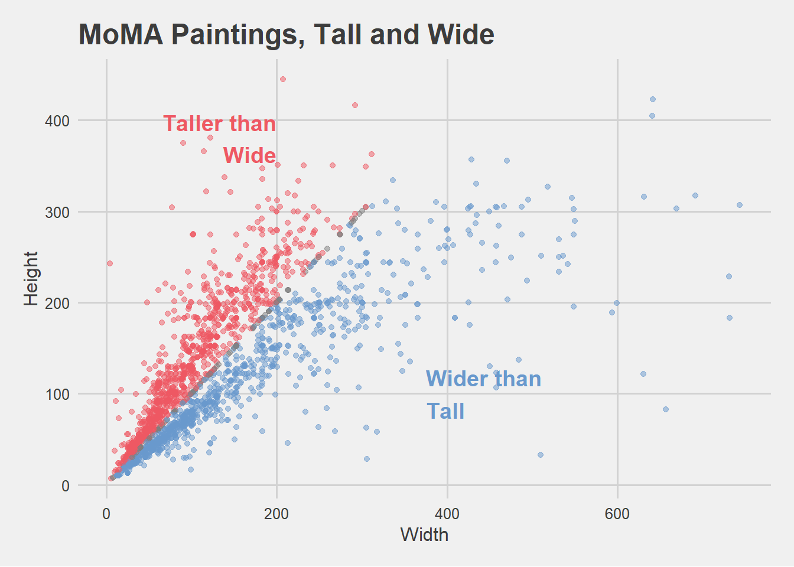

# Goals for Lab 02

- Review `dplyr` functions learned in last lab and DataCamp course
- Practice using `dplyr` functions to get to know a new dataset
- Map global plot aesthetics to variables in `ggplot2`
- Create facetted plots with `ggplot2`

# Slides for today


```r
#knitr::include_url("/slides/02-slides.html")
```


# Inspiration + data

We'll use data from the Museum of Modern Art (MoMA)

- Publicly available on [GitHub](https://github.com/MuseumofModernArt/collection)
- As analyzed by [fivethirtyeight.com](https://fivethirtyeight.com/features/a-nerds-guide-to-the-2229-paintings-at-moma/)
- And by [others](https://medium.com/@foe/here-s-a-roundup-of-how-people-have-used-our-data-so-far-80862e4ce220)

# Packages needed


```r
library(here) # to set file path if working from local file
library(tidyverse) # readr, ggplot2, dplyr
```


# Read in the data

Note! This is not the original data- I did a lot of cleaning and decision-making in the pre-processing. The below contains only paintings and drawings in the MoMA collection.

Use this code chunk to read in the data available at [http://bit.ly/cs631-moma](http://bit.ly/cs631-moma):


```r
library(readr)
moma <- read_csv("http://bit.ly/cs631-moma")
```

I called my cleaned data `artworks-cleaned.csv`, and stored it in a folder called `data`. You can use this code if you want to read in the local CSV file.


```r
#library(here)
library(readr)
library(dplyr)
#moma <- read_csv(here::here("static/labs/data", "artworks-cleaned.csv"))
```


# Know your data

<div class="panel panel-success">
  <div class="panel-heading">Challenge #1:</div>
  <div class="panel-body">
Try to answer all of these questions using `dplyr`. Answers are below but try them on your own first!

1. How many paintings (rows) are in `moma`? How many variables (columns) are in `moma`?
1. What is the first painting acquired by MoMA? Which year? Which artist? What title?
1. What is the oldest painting in the collection? Which year? Which artist? What title?
1. How many distinct artists are there?
1. Which artist has the most paintings in the collection? How many paintings are by this artist?
1. How many paintings by male vs female artists?


If you want more:

1. How many artists of each gender are there?
1. In what year were the most paintings acquired? Created?
1. In what year was the first painting by a (solo) female artist acquired? When was that painting created? Which artist? What title?
  </div>
</div>

## How many paintings?

- How many rows/observations are in `moma`?
- How many variables are in `moma`?

<p class="text-info"> __Hint:__ These questions can be answered using the `dplyr` function `glimpse`.</p>


```r
library(dplyr)
moma
```

```
# A tibble: 2,253 x 23
   title    artist   artist_bio    artist_birth_ye~ artist_death_ye~ num_artists
   <chr>    <chr>    <chr>                    <dbl>            <dbl>       <dbl>
 1 "Rope a~ Joan Mi~ (Spanish, 18~             1893             1983           1
 2 "Fire i~ Paul Kl~ (German, bor~             1879             1940           1
 3 "Portra~ Paul Kl~ (German, bor~             1879             1940           1
 4 "Guitar" Pablo P~ (Spanish, 18~             1881             1973           1
 5 "Grandm~ Arthur ~ (American, 1~             1880             1946           1
 6 "\"M'Am~ Francis~ (French, 187~             1879             1953           1
 7 "Untitl~ Blinky ~ (German, 194~             1943             1977           1
 8 "Daylig~ Pierre ~ (French, 188~             1880             1950           1
 9 "The Ba~ Paul Cé~ (French, 183~             1839             1906           1
10 "Synthe~ Enrico ~ (Italian, 18~             1894             1956           1
# ... with 2,243 more rows, and 17 more variables: n_female_artists <dbl>,
#   n_male_artists <dbl>, artist_gender <chr>, year_acquired <dbl>,
#   year_created <dbl>, circumference_cm <lgl>, depth_cm <dbl>,
#   diameter_cm <lgl>, height_cm <dbl>, length_cm <lgl>, width_cm <dbl>,
#   seat_height_cm <lgl>, purchase <lgl>, gift <lgl>, exchange <lgl>,
#   classification <chr>, department <chr>
```

```r
glimpse(moma)
```

```
Rows: 2,253
Columns: 23
$ title             <chr> "Rope and People, I", "Fire in the Evening", "Portra~
$ artist            <chr> "Joan Miró", "Paul Klee", "Paul Klee", "Pablo Picass~
$ artist_bio        <chr> "(Spanish, 1893–1983)", "(German, born Switzerland. ~
$ artist_birth_year <dbl> 1893, 1879, 1879, 1881, 1880, 1879, 1943, 1880, 1839~
$ artist_death_year <dbl> 1983, 1940, 1940, 1973, 1946, 1953, 1977, 1950, 1906~
$ num_artists       <dbl> 1, 1, 1, 1, 1, 1, 1, 1, 1, 1, 1, 1, 1, 1, 1, 1, 1, 1~
$ n_female_artists  <dbl> 0, 0, 0, 0, 0, 0, 0, 0, 0, 0, 0, 0, 0, 0, 0, 0, 0, 0~
$ n_male_artists    <dbl> 1, 1, 1, 1, 1, 1, 1, 1, 1, 1, 1, 1, 1, 1, 1, 1, 1, 1~
$ artist_gender     <chr> "Male", "Male", "Male", "Male", "Male", "Male", "Mal~
$ year_acquired     <dbl> 1936, 1970, 1966, 1955, 1939, 1968, 1997, 1931, 1934~
$ year_created      <dbl> 1935, 1929, 1927, 1919, 1925, 1919, 1970, 1929, 1885~
$ circumference_cm  <lgl> NA, NA, NA, NA, NA, NA, NA, NA, NA, NA, NA, NA, NA, ~
$ depth_cm          <dbl> NA, NA, NA, NA, NA, NA, NA, NA, NA, NA, NA, NA, NA, ~
$ diameter_cm       <lgl> NA, NA, NA, NA, NA, NA, NA, NA, NA, NA, NA, NA, NA, ~
$ height_cm         <dbl> 104.8, 33.8, 60.3, 215.9, 50.8, 129.2, 200.0, 54.6, ~
$ length_cm         <lgl> NA, NA, NA, NA, NA, NA, NA, NA, NA, NA, NA, NA, NA, ~
$ width_cm          <dbl> 74.6, 33.3, 36.8, 78.7, 54.0, 89.9, 200.0, 38.1, 96.~
$ seat_height_cm    <lgl> NA, NA, NA, NA, NA, NA, NA, NA, NA, NA, NA, NA, NA, ~
$ purchase          <lgl> FALSE, FALSE, FALSE, FALSE, FALSE, FALSE, FALSE, FAL~
$ gift              <lgl> TRUE, FALSE, FALSE, TRUE, TRUE, FALSE, TRUE, TRUE, F~
$ exchange          <lgl> FALSE, FALSE, FALSE, FALSE, TRUE, FALSE, FALSE, FALS~
$ classification    <chr> "Painting", "Painting", "Painting", "Painting", "Pai~
$ department        <chr> "Painting & Sculpture", "Painting & Sculpture", "Pai~
```


## What is the first painting acquired?


- What is the first painting acquired by MoMA (since they started tracking)? 
- What year was it acquired?
- Which artist?
- What title?

<p class="text-info"> __Hint:__ These questions can be answered by combining two `dplyr` functions: `select` and `arrange`.</p>


```r
moma %>% 
  select(artist, title, year_acquired) %>% 
  arrange(year_acquired)
```

```
# A tibble: 2,253 x 3
   artist           title                                          year_acquired
   <chr>            <chr>                                                  <dbl>
 1 Edward Hopper    House by the Railroad                                   1930
 2 Bernard Karfiol  Seated Nude                                             1930
 3 Pierre Roy       Daylight Savings Time                                   1931
 4 Preston Dickins~ Plums on a Plate                                        1931
 5 Otto Dix         Dr. Mayer-Hermann                                       1932
 6 Paul Cézanne     The Bather                                              1934
 7 Paul Cézanne     Pines and Rocks (Fontainebleau?)                        1934
 8 Paul Cézanne     Still Life with Ginger Jar, Sugar Bowl, and O~          1934
 9 Paul Cézanne     Still Life with Apples                                  1934
10 Arthur B. Davies Italian Landscape                                       1934
# ... with 2,243 more rows
```

## What is the oldest painting in the MoMA collection?


- What is the oldest painting in the MoMA collection historically (since they started tracking)? 
- What year was it created?
- Which artist?
- What title?

<p class="text-info"> __Hint:__ These questions can be answered by combining two `dplyr` functions: `select` and `arrange`.</p>


```r
moma %>% 
  select(artist, title, year_created) %>% 
  arrange(year_created)
```

```
# A tibble: 2,253 x 3
   artist       title                                    year_created
   <chr>        <chr>                                           <dbl>
 1 Odilon Redon Landscape at Daybreak                            1872
 2 Odilon Redon Apache (Man on Horseback)                        1875
 3 Odilon Redon Apache (Man on Horseback II)                     1875
 4 Odilon Redon Fishing Boat                                     1875
 5 Odilon Redon Rocky Peak                                       1875
 6 Odilon Redon The Rocky Slope                                  1875
 7 Odilon Redon Landscape with Rocks, near Royan                 1875
 8 Paul Cézanne Still Life with Fruit Dish                       1879
 9 Paul Cézanne L'Estaque                                        1879
10 Claude Monet On the Cliff at Pourville, Clear Weather         1882
# ... with 2,243 more rows
```


```r
oldest <- moma %>% 
  select(artist, title, year_created) %>% 
  arrange(year_created) %>% 
  slice(1)
oldest
```

```
# A tibble: 1 x 3
  artist       title                 year_created
  <chr>        <chr>                        <dbl>
1 Odilon Redon Landscape at Daybreak         1872
```

To do inline comments, I could say that the oldest painting is Landscape at Daybreak, painted by Odilon Redon in 1872.

## How many artists?

- How many distinct artists are there?

<p class="text-info"> __Hint:__ Try `dplyr::distinct`.</p>
 


```r
moma %>% 
  distinct(artist)
```

```
# A tibble: 989 x 1
   artist           
   <chr>            
 1 Joan Miró        
 2 Paul Klee        
 3 Pablo Picasso    
 4 Arthur Dove      
 5 Francis Picabia  
 6 Blinky Palermo   
 7 Pierre Roy       
 8 Paul Cézanne     
 9 Enrico Prampolini
10 Jankel Adler     
# ... with 979 more rows
```

You could add a `tally()` too to get just the number of rows. You can also then use `pull()` to get that single number out of the tibble:


```r
num_artists <- moma %>% 
  distinct(artist) %>% 
  tally() %>% 
  pull()
num_artists
```

```
[1] 989
```

Then I can refer to this number in inline comments like: there are 989 total.

## Which artist has the most paintings?

- Which artist has the most paintings ever owned by `moma`? 
- How many paintings in the MoMA collection by that artist?

<p class="text-info"> __Hint:__ Try `dplyr::count`. Use `?count` to figure out how to sort the output.</p>


```r
moma %>% 
  count(artist, sort = TRUE)
```

```
# A tibble: 989 x 2
   artist               n
   <chr>            <int>
 1 Pablo Picasso       55
 2 Henri Matisse       32
 3 On Kawara           32
 4 Jacob Lawrence      30
 5 Batiste Madalena    25
 6 Jean Dubuffet       25
 7 Odilon Redon        25
 8 Ben Vautier         24
 9 Frank Stella        23
10 Philip Guston       23
# ... with 979 more rows
```


In the `?count` documentation, it says: "`count` and `tally` are designed so that you can call them repeatedly, each time rolling up a level of detail." Try running `count()` again (leave parentheses empty) on your last code chunk.


```r
moma %>% 
  count(artist, sort = TRUE) %>% 
  count()
```

```
# A tibble: 1 x 1
      n
  <int>
1   989
```

## How many paintings by male vs female artists?


```r
moma %>% 
  count(artist_gender)
```

```
# A tibble: 3 x 2
  artist_gender     n
  <chr>         <int>
1 Female          252
2 Male           1991
3 <NA>             10
```


Now together we'll count the number of artists by gender. You'll need to give `count` two variable names in the parentheses: `artist_gender` and `artist`.


```r
moma %>% 
  count(artist_gender, artist, sort = TRUE) 
```

```
# A tibble: 989 x 3
   artist_gender artist               n
   <chr>         <chr>            <int>
 1 Male          Pablo Picasso       55
 2 Male          Henri Matisse       32
 3 Male          On Kawara           32
 4 Male          Jacob Lawrence      30
 5 Male          Batiste Madalena    25
 6 Male          Jean Dubuffet       25
 7 Male          Odilon Redon        25
 8 Male          Ben Vautier         24
 9 Male          Frank Stella        23
10 Male          Philip Guston       23
# ... with 979 more rows
```

This output is not superhelpful as we already know that Pablo Picasso has 55 paintings in the MoMA collection. But how can we find out which female artist has the most paintings? We have a few options. Let's first add a `filter` for females.


```r
moma %>% 
  count(artist_gender, artist, sort = TRUE) %>% 
  filter(artist_gender == "Female")
```

```
# A tibble: 143 x 3
   artist_gender artist                    n
   <chr>         <chr>                 <int>
 1 Female        Sherrie Levine           12
 2 Female        Agnes Martin              9
 3 Female        Elizabeth Murray          8
 4 Female        Susan Rothenberg          8
 5 Female        Joan Mitchell             6
 6 Female        Loren MacIver             6
 7 Female        R. H. Quaytman            6
 8 Female        Helen Frankenthaler       5
 9 Female        Georgia O'Keeffe          4
10 Female        Lynette Yiadom-Boakye     4
# ... with 133 more rows
```

Another option is to use another `dplyr` function called `top_n()`. Use `?top_n` to see how it works. How it won't work in this context:


```r
moma %>% 
  count(artist_gender, artist, sort = TRUE) %>% 
  top_n(2)
```

```
# A tibble: 3 x 3
  artist_gender artist            n
  <chr>         <chr>         <int>
1 Male          Pablo Picasso    55
2 Male          Henri Matisse    32
3 Male          On Kawara        32
```

How it will work better is following a `group_by(artist_gender)`:


```r
moma %>% 
  count(artist_gender, artist, sort = TRUE) %>% 
  group_by(artist_gender) %>% 
  top_n(1)
```

```
# A tibble: 3 x 3
# Groups:   artist_gender [3]
  artist_gender artist                                                 n
  <chr>         <chr>                                              <int>
1 Male          Pablo Picasso                                         55
2 Female        Sherrie Levine                                        12
3 <NA>          Gilbert & George, Gilbert Proesch, George Passmore     2
```


Now we can see that Sherrie Levine has 12 paintings. This is a pretty far cry from the 55 paintings by Pablo Picasso.

## How many artists of each gender are there?

This is a harder question to answer than you think! This is because the level of observation in our current `moma` dataset is *unique paintings*. We have multiple paintings done by the same artists though, so counting just the number of unique paintings is different than counting the number of unique artists. 

Remember how `count` can be used back-to-back to roll up a level of detail? Try running `count(artist_gender)` again on your last code chunk.


```r
moma %>% 
  count(artist_gender, artist) %>% 
  count(artist_gender)
```

```
# A tibble: 3 x 2
  artist_gender     n
  <chr>         <int>
1 Female          143
2 Male            837
3 <NA>              9
```


This output takes the previous table (made with `count(artist_gender, artist)`), and essentially ignores the `n` column. So we no longer care about how *many* paintings each individual artist created. Instead, we want to `count` the rows in this *new* table where each row is a unique artist. By counting by `artist_gender` in the last line, we are grouping by levels of that variable (so Female/Male/`NA`) and `nn` is the number of unique artists for each gender category recorded.

## When were the most paintings in the collection acquired?


<p class="text-info"> __Hint:__ Try `dplyr::count`. Use `?count` to figure out how to sort the output.</p>


```r
moma %>% 
  count(year_acquired, sort = TRUE)
```

```
# A tibble: 88 x 2
   year_acquired     n
           <dbl> <int>
 1          1985    86
 2          1942    71
 3          1979    71
 4          1991    67
 5          2005    67
 6          1967    65
 7          2008    55
 8          1961    45
 9          1969    45
10          1956    42
# ... with 78 more rows
```

## When were the most paintings in the collection created?


<p class="text-info"> __Hint:__ Try `dplyr::count`. Use `?count` to figure out how to sort the output.</p>


```r
moma %>% 
  count(year_created, sort = TRUE)
```

```
# A tibble: 139 x 2
   year_created     n
          <dbl> <int>
 1         1977    57
 2         1940    56
 3         1964    56
 4         1961    50
 5         1962    49
 6         1963    44
 7         1959    42
 8         1968    40
 9         1960    39
10         1914    37
# ... with 129 more rows
```


## What about the first painting by a solo female artist?


<p class="text-info"> __Hint:__ Try combining three `dplyr` functions: `filter`, `select`, and `arrange`.</p>

When was the first painting by a solo female artist acquired?


```r
moma %>% 
  filter(num_artists == 1 & n_female_artists == 1) %>% 
  select(title, artist, year_acquired, year_created) %>% 
  arrange(year_acquired)
```

```
# A tibble: 252 x 4
   title                        artist                year_acquired year_created
   <chr>                        <chr>                         <dbl>        <dbl>
 1 Landscape, 47                Natalia Goncharova             1937         1912
 2 Shack                        Loren MacIver                  1938         1934
 3 Hopscotch                    Loren MacIver                  1940         1940
 4 Shadows with Painting        Irene Rice Pereira             1941         1940
 5 Figure                       Varvara Stepanova              1941         1921
 6 Still Life in Red            Amelia Peláez Del Ca~          1942         1938
 7 White Lines                  Irene Rice Pereira             1942         1942
 8 Musical Squash               Maud Morgan                    1942         1942
 9 Desolation                   Raquel Forner                  1942         1942
10 Self-Portrait with Cropped ~ Frida Kahlo                    1943         1940
# ... with 242 more rows
```

What is the oldest painting by a solo female artist, and when was it created?


```r
moma %>% 
  filter(num_artists == 1 & n_female_artists == 1) %>% 
  select(title, artist, year_acquired, year_created) %>% 
  arrange(year_created)
```

```
# A tibble: 252 x 4
   title                              artist          year_acquired year_created
   <chr>                              <chr>                   <dbl>        <dbl>
 1 Self-Portrait with Two Flowers in~ Paula Modersoh~          2017         1907
 2 Girl with Bare Shoulders           Gwen John                1958         1909
 3 Girl Reading at a Window           Gwen John                1971         1911
 4 Landscape, 47                      Natalia Goncha~          1937         1912
 5 Cubist Nude                        Alexandra Exter          1991         1912
 6 Rayonism, Blue-Green Forest        Natalia Goncha~          1985         1913
 7 The Factory and the Bridge         Olga Rozanova            1985         1913
 8 Subject from a Dyer's Shop         Lyubov Popova            1985         1914
 9 Portuguese Market                  Sonia Delaunay~          1955         1915
10 Girl with a Blue Scarf             Gwen John                1963         1915
# ... with 242 more rows
```


```r
# or, because artist_gender is missing when num_artists > 1
moma %>% 
  filter(artist_gender == "Female") %>% 
  select(title, artist, year_acquired, year_created) %>% 
  arrange(year_acquired)
```

# Basics of `ggplot2`

<div class="panel panel-success">
  <div class="panel-heading">Challenge #2:</div>
  <div class="panel-body">
We'll do this together *(nothing to turn in)*: see [slides](https://apreshill.github.io/data-vis-labs-2018/slides/02-slides.html#16).
  </div>
</div>


# Plot your data


## Plot year painted vs year acquired

 


<div class="panel panel-success">
  <div class="panel-heading">Challenge #3:</div>
  <div class="panel-body">
Let's recreate this plot from [fivethirtyeight](https://fivethirtyeight.com/features/a-nerds-guide-to-the-2229-paintings-at-moma/) (mostly)!


Things to consider:

- You'll want to play around with setting an `alpha` value here- keep in mind that `0` is totally transparent and `1` is opaque. 
- Try using `geom_abline()` to add the line in red (use the default intercept value of 0). The actual red line is difficult to recreate- here is what the authors say: "The red regression line shows the “modernizing” of MoMA’s collection — how quickly the museum has moved toward acquiring recent paintings."
- Go back to [Lab 01](https://apreshill.github.io/data-vis-labs-2018/01-eda_hot_dogs.html) to review how to do the following:
    - Change the x- and y-axis labels and the plot title to match the plot above
  </div>
</div>


```r
ggplot(moma, aes(year_created, year_acquired)) +
  geom_point(alpha = .1, na.rm = TRUE) +
  geom_abline(intercept = c(0,0), colour = "red") +
  labs(x = "Year Painted", y = "Year Acquired") +
  ggtitle("MoMA Keeps Its Collection Current") 
```




## Facet by artist gender

Can you make the same plot above, but facet by artist gender? 

<p class="text-info"> __Hint:__ For this to make sense, you probably want to do some filtering to select only those paintings where there was one "solo" artist.</p>


```r
moma_solo <- moma %>% 
  filter(num_artists == 1)
ggplot(moma_solo, aes(year_created, year_acquired)) +
  geom_point(alpha = .1) +
  geom_abline(intercept = c(0,0), colour = "red") +
  labs(x = "Year Painted", y = "Year Acquired") +
  ggtitle("MoMA Keeps Its Collection Current") +
  facet_wrap(~artist_gender)
```




# Plot painting dimensions

<div class="panel panel-success">
  <div class="panel-heading">Challenge #4:</div>
  <div class="panel-body">
Let's (somewhat) try to recreate this scatterplot from [fivethirtyeight](https://fivethirtyeight.com/features/a-nerds-guide-to-the-2229-paintings-at-moma/). 


To recreate, some things to consider:

- Try filtering all paintings with height less than 600 cm and width less than 760 cm. 
- If you want to add color as in the original, you'll need to create a new variable using `mutate`. 


<p class="text-info"> __Hint:__ You'll probably also want to look into `case_when` to create a categorical variable to color by.</p>
  </div>
</div>


```r
moma_dim <- moma %>% 
  filter(height_cm < 600, width_cm < 760) %>% 
  mutate(hw_ratio = height_cm / width_cm,
         hw_cat = case_when(
           hw_ratio > 1 ~ "taller than wide",
           hw_ratio < 1 ~ "wider than tall",
           hw_ratio == 1 ~ "perfect square"
         ))
library(ggthemes)
ggplot(moma_dim, aes(x = width_cm, y = height_cm, colour = hw_cat)) +
  geom_point(alpha = .5) +
  ggtitle("MoMA Paintings, Tall and Wide") +
  scale_colour_manual(name = "",
                      values = c("gray50", "#FF9900", "#B14CF0")) +
  theme_fivethirtyeight() +
  theme(axis.title = element_text()) +
  labs(x = "Width", y = "Height") 
```


Because Grace is right, we can do better with colors!


```r
library(ggthemes)
ggplot(moma_dim, aes(x = width_cm, y = height_cm, colour = hw_cat)) +
  geom_point(alpha = .5) +
  ggtitle("MoMA Paintings, Tall and Wide") +
  scale_colour_manual(name = "",
                      values = c("gray50", "#ee5863", "#6999cd")) +
  theme_fivethirtyeight() +
  theme(axis.title = element_text()) +
  labs(x = "Width", y = "Height") 
```



We could also do away with the legend and use `geom_annotate` instead.


```r
library(ggthemes)
ggplot(moma_dim, aes(x = width_cm, y = height_cm, colour = hw_cat)) +
  geom_point(alpha = .5, show.legend = FALSE) +
  ggtitle("MoMA Paintings, Tall and Wide") +
  scale_colour_manual(name = "",
                      values = c("gray50", "#ee5863", "#6999cd")) +
  theme_fivethirtyeight() +
  theme(axis.title = element_text()) +
  labs(x = "Width", y = "Height") +
  annotate(x = 200, y = 380, geom = "text", 
           label = "Taller than\nWide", color = "#ee5863", 
           size = 5, family = "Lato", hjust = 1, fontface = 2) +
    annotate(x = 375, y = 100, geom = "text", 
             label = "Wider than\nTall", color = "#6999cd", 
             size = 5, family = "Lato", hjust = 0, fontface = 2)
```



# Plot something new & different!

<div class="panel panel-success">
  <div class="panel-heading">Challenge #5:</div>
  <div class="panel-body">
It can be anything- you can change colors, add annotations, switch the geoms, add new variables to examine- the world is your oyster! The only requirements are:

1. You *make* one new plot that is original, and 
2. You *write* 1-2 sentences to present the plot and why it makes sense. What questions do you think your plot can help you to answer?

It does not have to be pretty right now, but it must make sense as a visualization- you must be able to intelligently and succintly tell us about it in real words.
  </div>
</div>


