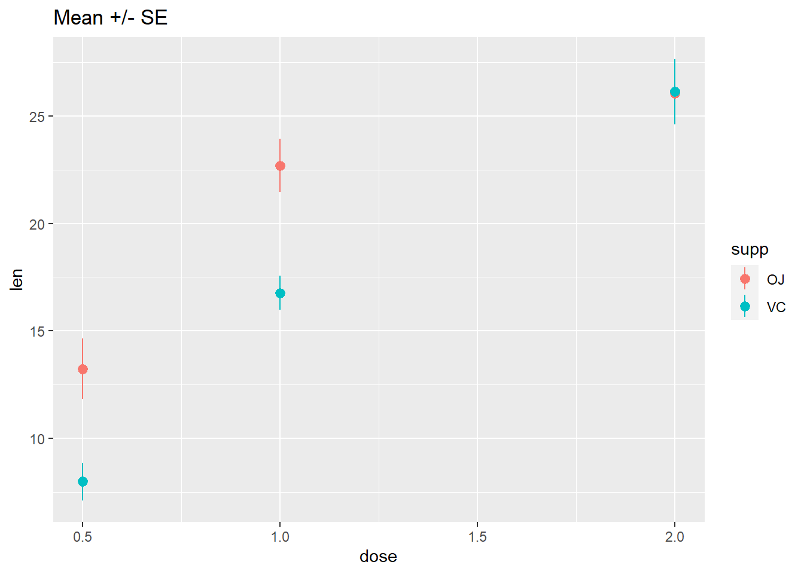
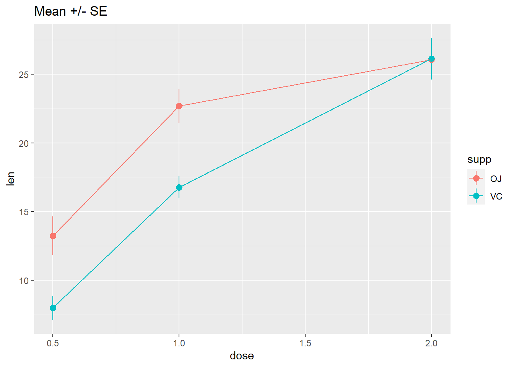
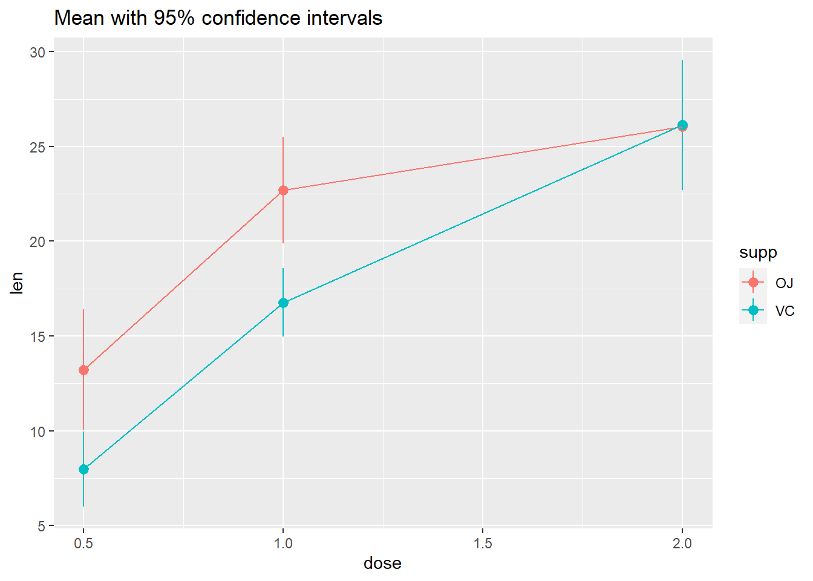
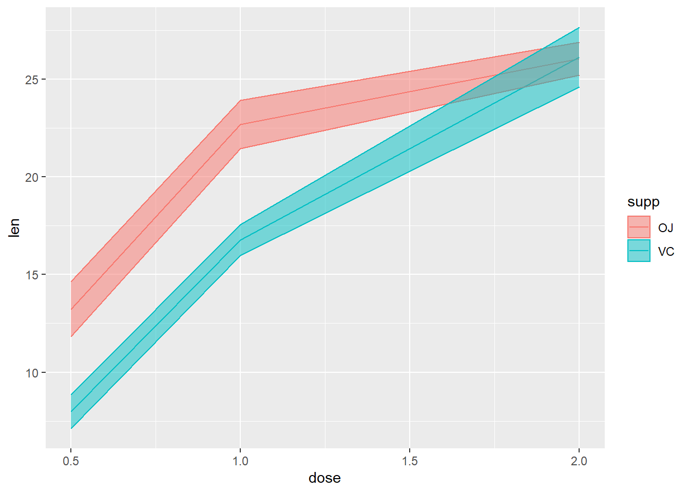
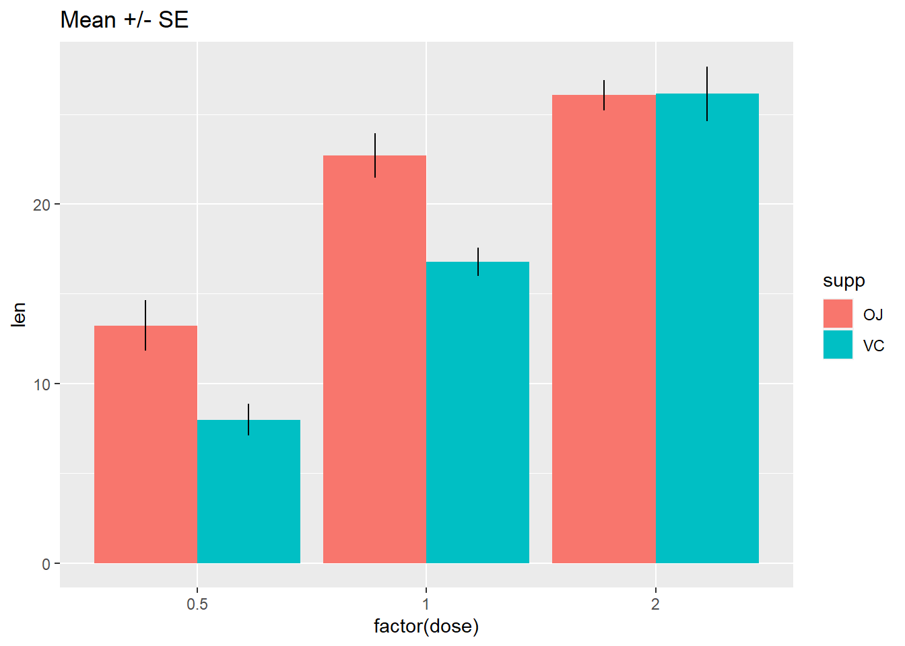
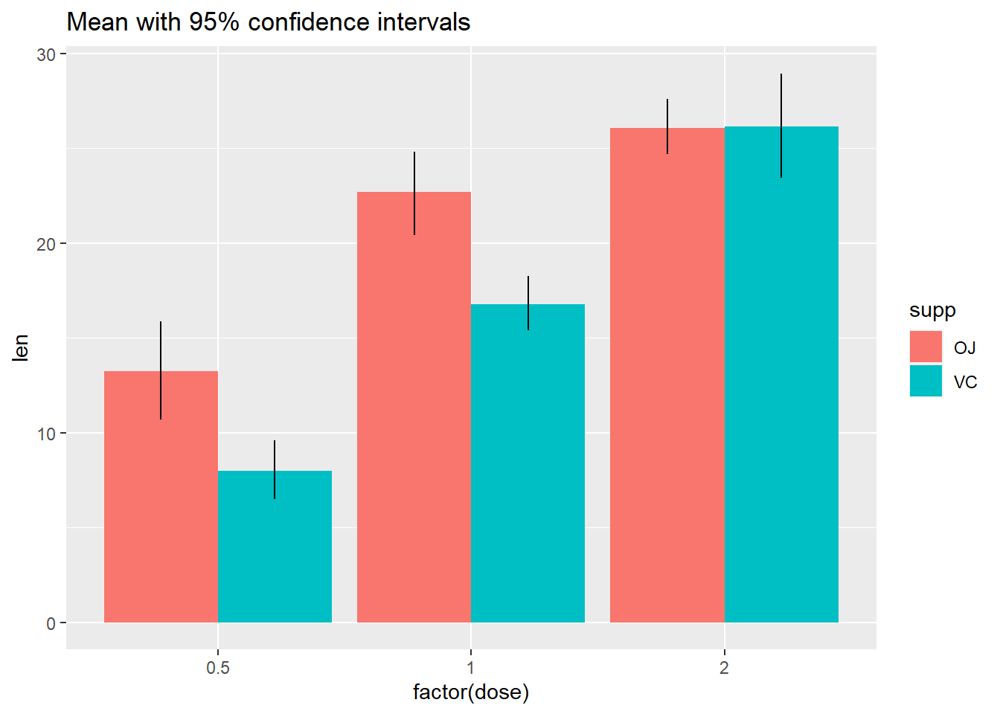

# Slides for today

<iframe src="/slides/04-slides.html" width="672" height="400px"></iframe>

# Packages

New ones to install:


```r
install.packages("ggbeeswarm")
install.packages("skimr")
install.packages("janitor")
install.packages("ggridges")
```


To load:


```r
library(tidyverse)
library(ggbeeswarm)
library(skimr)
library(janitor)
library(ggridges)
```

# Make the data

Below are simulated four distributions (n = 100 each), all with similar measures of center (mean = 0) and spread (s.d. = 1), but with distinctly different shapes.^[The [code for these distributions](https://github.com/hadley/boxplots-paper/blob/master/boxplots-density.r) comes from Hadley Wickham's paper on ["40 years of boxplots"](http://vita.had.co.nz/papers/boxplots.html)]

1. A standard normal (`n`);
2. A skew-right distribution (`s`, Johnson distribution with skewness 2.2 and kurtosis 13);
3. A leptikurtic distribution (`k`, Johnson distribution with skewness 0
and kurtosis 30);
4. A bimodal distribution (`mm`, two normals with mean -0.95 and 0.95 and standard deviation 0.31). 


```r
#install.packages("SuppDists")
library(SuppDists)
# this is used later to generate the s and k distributions
findParams <- function(mu, sigma, skew, kurt) {
  value <- .C("JohnsonMomentFitR", as.double(mu), as.double(sigma), 
    as.double(skew), as.double(kurt - 3), gamma = double(1), 
    delta = double(1), xi = double(1), lambda = double(1), 
    type = integer(1), PACKAGE = "SuppDists")
   list(gamma = value$gamma, delta = value$delta, 
    xi = value$xi, lambda = value$lambda, 
    type = c("SN", "SL", "SU", "SB")[value$type])  
}
```


```r
# Generate sample data -------------------------------------------------------
set.seed(141079)
# normal
n <- rnorm(100)
# right-skew
s <- rJohnson(100, findParams(0, 1, 2.2, 13))
```

```
Error in .C("JohnsonMomentFitR", as.double(mu), as.double(sigma), as.double(skew), : "JohnsonMomentFitR" not available for .C() for package "SuppDists"
```

```r
# leptikurtic
k <- rJohnson(100, findParams(0, 1, 0, 30))
```

```
Error in .C("JohnsonMomentFitR", as.double(mu), as.double(sigma), as.double(skew), : "JohnsonMomentFitR" not available for .C() for package "SuppDists"
```

```r
# mixture
mm <- rnorm(100, rep(c(-1, 1), each = 50) * sqrt(0.9), sqrt(0.1))
```


# Tidy the data


```r
four <- data.frame(
  dist = factor(rep(c("n", "s", "k", "mm"), 
                    each = 100),
                c("n", "s", "k", "mm")),
  vals = c(n, s, k, mm)
)
```

```
Error in data.frame(dist = factor(rep(c("n", "s", "k", "mm"), each = 100), : object 's' not found
```

# Explore the data


```r
glimpse(four)
```

```
Error in glimpse(four): object 'four' not found
```


Let's see what our descriptive statistics look like:


```r
skim(four)
```

```
Error in skim(four): object 'four' not found
```

```r
four %>% 
  group_by(dist) %>% 
  skim()
```

```
Error in group_by(., dist): object 'four' not found
```


# Histograms

What you want to look for:

* How many "mounds" do you see? (modality)
* If 1 mound, find the peak: are the areas to the left and right of the peak symmetrical? (skewness)
* Notice that kurtosis (peakedness) of the distribution is difficult to judge here, especially given the effects of differing binwidths.


The nice thing about `ggplot` is that we can use `facet_wrap`, and the x- and y-axes are the same, and the size of the binwidths are also the same. 


```r
#2 x 2 histograms in ggplot
ggplot(four, aes(x = vals)) + #no y needed for visualization of univariate distributions
  geom_histogram(fill = "white", colour = "black") + #easier to see for me
  coord_cartesian(xlim = c(-5, 5)) + #use this to change x/y limits!
  facet_wrap(~ dist) #this is one factor variable with 4 levels
```

```
Error in ggplot(four, aes(x = vals)): object 'four' not found
```


## Binwidths 

Always change the binwidths on a histogram. Sometimes the default in `ggplot` works great, sometimes it does not.

Super narrow:


```r
#2 x 2 histograms in ggplot
ggplot(four, aes(x = vals)) + 
  geom_histogram(binwidth = .1, fill = "white", colour = "black") + #super narrow bins
  coord_cartesian(xlim = c(-5, 5)) + 
  facet_wrap(~ dist)
```

```
Error in ggplot(four, aes(x = vals)): object 'four' not found
```

Super wide: 

```r
#2 x 2 histograms in ggplot
ggplot(four, aes(x = vals)) + 
  geom_histogram(binwidth = 2, fill = "white", colour = "black") + #super wide bins
  coord_cartesian(xlim = c(-5, 5)) + 
  facet_wrap(~ dist)
```

```
Error in ggplot(four, aes(x = vals)): object 'four' not found
```

Just right? Pretty close to the default for this data.


```r
#2 x 2 histograms in ggplot
ggplot(four, aes(x = vals)) + 
  geom_histogram(binwidth = .2, fill = "white", colour = "black") + 
  coord_cartesian(xlim = c(-5, 5)) + 
  facet_wrap(~ dist)
```

```
Error in ggplot(four, aes(x = vals)): object 'four' not found
```

## Add a rug


```r
#2 x 2 histograms in ggplot
ggplot(four, aes(x = vals)) + 
  geom_histogram(binwidth = .2, fill = "white", colour = "black") + 
  geom_rug() + 
  coord_cartesian(xlim = c(-5, 5)) + 
  facet_wrap(~ dist)
```

```
Error in ggplot(four, aes(x = vals)): object 'four' not found
```


# Boxplots (medium to large N)

What you want to look for:

* The center line is the median: does the length of the distance to the upper hinge appear equal to the length to the lower hinge? (symmetry/skewness: Q3 - Q2/Q2 - Q1)
* Are there many outliers? 
* Notice that modality of the distribution is difficult to judge here.


```r
ggplot(four, aes(y = vals, x = dist)) + 
  geom_boxplot() + 
  scale_x_discrete(name="") + 
  scale_y_continuous(name="") + 
  coord_cartesian(ylim = c(-4,4))
```

```
Error in ggplot(four, aes(y = vals, x = dist)): object 'four' not found
```

## Add notches

[ggplot notches](http://docs.ggplot2.org/0.9.3.1/geom_boxplot.html): "Notches are used to compare groups; if the notches of two boxes do not overlap, this is strong evidence that the medians differ." (Chambers et al., 1983, p. 62)


```r
ggplot(four, aes(y = vals, x = dist)) + 
  geom_boxplot(notch = T) + 
  scale_x_discrete(name = "") + 
  scale_y_continuous(name = "") + 
  coord_cartesian(ylim = c(-4,4))
```

```
Error in ggplot(four, aes(y = vals, x = dist)): object 'four' not found
```


## Add summary statistics

Here we add a diamond for the mean (see other possible shape codes [here](http://www.cookbook-r.com/Graphs/Shapes_and_line_types/)). 


```r
ggplot(four, aes(x = dist, y = vals)) + 
  geom_boxplot() +
  stat_summary(fun.y = mean, 
               geom = "point", 
               shape = 18, 
               size = 4, 
               colour = "lightseagreen") + 
  coord_cartesian(ylim = c(-4, 4))
```

```
Error in ggplot(four, aes(x = dist, y = vals)): object 'four' not found
```

# Univariate scatterplots (small to medium n)

Options:

* [Stripchart](http://stat.ethz.ch/R-manual/R-patched/library/graphics/html/stripchart.html): "one dimensional scatter plots (or dot plots) of the given data. These plots are a good alternative to boxplots when sample sizes are small."
* [Beeswarm](https://cran.r-project.org/web/packages/beeswarm/beeswarm.pdf): "A bee swarm plot is a one-dimensional scatter plot similar to 'stripchart', except that would-be overlapping points are separated such that each is visible."

## Stripchart

Combining `geom_jitter() + stat_summary()` is the ggplot corollary to a stripchart.


```r
ggplot(four, aes(x = dist, y = vals)) +
  geom_jitter(position = position_jitter(height = 0, width = .1), 
              fill = "lightseagreen", 
              colour = "lightseagreen",
              alpha = .5) + 
  stat_summary(fun.y = median, 
               fun.ymin = median, 
               fun.ymax = median, 
               geom = "crossbar", 
               width = 0.5) +
  scale_x_discrete(name = "") + 
  scale_y_continuous(name = "") + 
  coord_cartesian(ylim = c(-4, 4))
```

```
Error in ggplot(four, aes(x = dist, y = vals)): object 'four' not found
```


## Dotplot

This is a beeswarm-like ggplot- not exactly the same, but gives you the same idea.


```r
ggplot(four, aes(x = dist, y = vals)) +
  geom_dotplot(stackdir = "center", 
               binaxis = "y", 
               binwidth = .1,
               binpositions = "all",
               stackratio = 1.5, 
               fill = "lightseagreen", 
               colour = "lightseagreen") + 
  scale_x_discrete(name = "") + 
  scale_y_continuous(name = "") + 
  coord_cartesian(ylim = c(-4, 4))
```

```
Error in ggplot(four, aes(x = dist, y = vals)): object 'four' not found
```


## Beeswarm

https://github.com/eclarke/ggbeeswarm


```r
install.packages("ggbeeswarm")
library(ggbeeswarm)
```


```r
ggplot(four, aes(x = dist, y = vals)) +
  geom_quasirandom(fill = "lightseagreen", 
               colour = "lightseagreen") + 
  scale_x_discrete(name = "") + 
  scale_y_continuous(name = "") + 
  coord_cartesian(ylim = c(-4, 4))
```

```
Error in ggplot(four, aes(x = dist, y = vals)): object 'four' not found
```


```r
ggplot(four, aes(x = dist, y = vals)) +
  geom_quasirandom(fill = "lightseagreen", 
               colour = "lightseagreen", 
               method = "smiley") + 
  scale_x_discrete(name = "") + 
  scale_y_continuous(name = "") + 
  coord_cartesian(ylim = c(-4, 4))
```

```
Error in ggplot(four, aes(x = dist, y = vals)): object 'four' not found
```

Note that these recommendations do not apply if your data is "big". You will know your data is too big if you try the below methods and you can't see many of the individual points (typically, N > 100). 

# Boxplots + univariate scatterplots (small to medium n)


Combining `geom_boxplot() + geom_dotplot()` is my personal pick for EDA when I have small - medium data (N < 100).


```r
ggplot(four, aes(y = vals, x = dist)) + 
  geom_boxplot(outlier.shape = NA) + 
  geom_dotplot(binaxis = 'y', 
               stackdir = 'center', 
               stackratio = 1.5, 
               binwidth = .1,
               binpositions = "all",
               dotsize = 1,
               alpha = .75, 
               fill = "lightseagreen", 
               colour = "lightseagreen",
               na.rm = TRUE) + 
  scale_x_discrete(name = "") + 
  scale_y_continuous(name = "") + 
  coord_cartesian(ylim = c(-4, 4))
```

```
Error in ggplot(four, aes(y = vals, x = dist)): object 'four' not found
```


You can also combin `geom_boxplot() + geom_jitter()`. I left the outliers in to demonstrate the jittered points only go left to right because I set the jitter `height = 0`.


```r
ggplot(four, aes(y = vals, x = dist)) + 
  geom_boxplot(width = .5) + #left the outliers in here, so they are double-plotted
  geom_jitter(fill = "lightseagreen", 
              colour = "lightseagreen",
              na.rm = TRUE,
              position = position_jitter(height = 0, width = .1),
              alpha = .5) + 
  scale_x_discrete(name = "") + 
  scale_y_continuous(name = "") + 
  coord_cartesian(ylim = c(-4, 4))
```

```
Error in ggplot(four, aes(y = vals, x = dist)): object 'four' not found
```

# Density plots (medium to large n)

A few ways to do this:

* [Kernel density](https://chemicalstatistician.wordpress.com/2013/06/09/exploratory-data-analysis-kernel-density-estimation-in-r-on-ozone-pollution-data-in-new-york-and-ozonopolis/): "Kernel density estimation (KDE) is a non-parametric way to estimate the probability density function of a random variable. Kernel density estimation is a fundamental data smoothing problem where inferences about the population are made, based on a finite data sample." - from [wikipedia](https://en.wikipedia.org/wiki/Kernel_density_estimation)
* [Violin plots](https://cran.r-project.org/web/packages/UsingR/UsingR.pdf): "This function serves the same utility as side-by-side boxplots, only it provides more detail about the different distribution. It plots violinplots instead of boxplots. That is, instead of a box, it uses the density function to plot the density. For skewed distributions, the results look like "violins". Hence the name." 
    - Some violin plots also include the boxplot so you can see Q1/Q2/Q3.
* [Beanplots](https://cran.r-project.org/web/packages/beanplot/vignettes/beanplot.pdf): "The name beanplot stems from green beans. The density shape can be seen as the pod of a green bean, while the scatter plot shows the seeds inside the pod."


## Density plots


```r
ggplot(four, aes(x = vals)) + 
  geom_density(fill = "lightseagreen") +
  coord_cartesian(xlim = c(-5, 5)) +
  facet_wrap(~ dist)
```

```
Error in ggplot(four, aes(x = vals)): object 'four' not found
```

Instead of doing a `facet_wrap`, I could make just one plot showing all four distributions. To make each distribution a different color, set the `fill` within the `aes`, and assign it to the factor variable `dist`. Since now all four will be plotted on top of each other, add an `alpha` level to make the color fill transparent (0 = completely transparent; 1 = completely opaque).


```r
# Density plots with semi-transparent fill
ggplot(four, aes(x = vals, fill = dist)) + 
  geom_density(alpha = .5)
```

```
Error in ggplot(four, aes(x = vals, fill = dist)): object 'four' not found
```

### Add a histogram

These are pretty easy to make in `ggplot`. However, note that the y-axis is different from if you just plotted the histogram. In fact, when interpreting this plot, the y-axis is only meaningful for reading density. It is meaningless for interpreting the histogram.


```r
ggplot(four, aes(x = vals)) + 
  geom_histogram(aes(y = ..density..), 
                 binwidth = .5, 
                 colour = "black", 
                 fill = "white") +
  geom_density(alpha = .5, fill = "lightseagreen") + 
  coord_cartesian(xlim = c(-5,5)) + 
  facet_wrap(~ dist)
```

```
Error in ggplot(four, aes(x = vals)): object 'four' not found
```

## Violin plots

My advice: always set `color = NA` for `geom_violin`. For fill, always set `alpha`.


```r
ggplot(four, aes(x = dist, y = vals)) +
    geom_violin(color = NA,
                fill = "lightseagreen",
                alpha = .5,
                na.rm = TRUE,
                scale = "count") + # max width proportional to sample size
  coord_cartesian(ylim = c(-4, 4))
```

```
Error in ggplot(four, aes(x = dist, y = vals)): object 'four' not found
```

### Add a boxplot

Combination `geom_violin() + geom_boxplot()` is my personal pick for EDA when I have large data (N > 100).


```r
ggplot(four, aes(x = dist, y = vals)) +
    geom_boxplot(outlier.size = 2, 
                 colour = "lightseagreen",
                 fill = "black",
                 na.rm = TRUE,
                 width = .1) + 
    geom_violin(alpha = .2, 
                fill = "lightseagreen",
                colour = NA,
                na.rm = TRUE) +
  coord_cartesian(ylim = c(-4, 4))
```

```
Error in ggplot(four, aes(x = dist, y = vals)): object 'four' not found
```

Note that it is just as easy to layer a univariate scatterplot over a violin plot, just by replacing the `geom_boxplot` with a different geom as shown abobe. Lots of combination plots are possible! 

# Split violin

Using David Robinson's code: https://gist.github.com/dgrtwo/eb7750e74997891d7c20


```r
ggplot(four, aes(x = dist, y = vals)) +
    geom_flat_violin(alpha = .5, 
                fill = "lightseagreen",
                colour = NA,
                na.rm = TRUE) +
    coord_flip()
```

```
Error in ggplot(four, aes(x = dist, y = vals)): object 'four' not found
```


# Ridgeline plots

Typically makes the most sense to have the factor variable like `dist` on the y-axis for these.

https://cran.r-project.org/web/packages/ggridges/vignettes/introduction.html


```r
# play with scale
ggplot(four, aes(x = vals, y = dist)) +
  geom_density_ridges(scale = 0.9, 
                      fill = "lightseagreen", 
                      alpha = .5)
```

```
Error in ggplot(four, aes(x = vals, y = dist)): object 'four' not found
```

# Raincloud plots

https://cran.r-project.org/web/packages/ggridges/vignettes/introduction.html


```r
ggplot(four, aes(x = vals, y = dist)) +
  geom_density_ridges(jittered_points = TRUE, 
                      position = "raincloud",
                      fill = "lightseagreen", 
                      alpha = 0.7, 
                      scale = 0.7)
```

```
Error in ggplot(four, aes(x = vals, y = dist)): object 'four' not found
```


# Plotting summary statistics

The more general `stat_summary` function applies a summary function to the variable mapped to y at each x value.

## Means and error bars 

The simplest summary function is `mean_se`, which returns the mean and the mean plus its standard error on each side. Thus, `stat_summary` will calculate and plot the mean and standard errors for the y variable at each x value. 

The default geom is "pointrange" which places a dot at the central y value and extends lines to the minimum and maximum y values. Other geoms you might consider to display summarized data:

* `geom_errorbar`
* `geom_pointrange`
* `geom_linerange`
* `geom_crossbar` 

There are a few summary functions from the `Hmisc` package which are reformatted for use in `stat_summary()`. They all return aesthetics for `y`, `ymax`, and `ymin`.

* `mean_cl_normal()`
    - Returns sample mean and 95% confidence intervals assuming normality (i.e., t-distribution based) 
* `mean_sdl()`
    - Returns sample mean and a confidence interval based on the standard deviation times some constant
* `mean_cl_boot()`
    - Uses a bootstrap method to determine a confidence interval for the sample mean without assuming normality.
* `median_hilow()`
    - Returns the median and an upper and lower quantiles.


```r
ggplot(four, aes(x = dist, y = vals)) +
  stat_summary(fun.data = "mean_se")
```

```
Error in ggplot(four, aes(x = dist, y = vals)): object 'four' not found
```


```r
ggplot(four, aes(x = dist, y = vals)) +
  stat_summary(fun.y = "mean", geom = "point") +
  stat_summary(fun.y = "max", geom = "point", shape = 21)
```

```
Error in ggplot(four, aes(x = dist, y = vals)): object 'four' not found
```


```r
ggplot(four, aes(x = dist, y = vals)) +
  stat_summary(fun.data = median_hilow)
```

```
Error in ggplot(four, aes(x = dist, y = vals)): object 'four' not found
```


You may have noticed two different arguments that are potentially confusing: `fun.data` and `fun.y`. If the function returns three values, specify the function with the argument `fun.data`. If the function returns one value, specify `fun.y`. See below.


```r
x <- c(1, 2, 3)
mean(x) # use fun.y
```

```
[1] 2
```

```r
mean_cl_normal(x) # use fun.data
```

```
  y       ymin     ymax
1 2 -0.4841377 4.484138
```

Confidence limits may give us a better idea than standard error limits of whether two means would be deemed statistically different when modeling, so we frequently use `mean_cl_normal` or `mean_cl_boot` in addition to `mean_se`.


## Connecting means with lines

Using the `ToothGrowth` dataset


```r
data(ToothGrowth)
tg <- ToothGrowth
```


```r
# Standard error of the mean
ggplot(tg, aes(x = dose, y = len, colour = supp)) + 
  stat_summary(fun.data = "mean_se") +
  ggtitle("Mean +/- SE")
```



```r
# Connect the points with lines
ggplot(tg, aes(x = dose, y = len, colour = supp)) + 
  stat_summary(fun.data = "mean_se") +
  stat_summary(fun.y = mean, geom = "line") +
  ggtitle("Mean +/- SE")
```



```r
# Use 95% confidence interval instead of SEM
ggplot(tg, aes(x = dose, y = len, colour = supp)) + 
  stat_summary(fun.data = "mean_cl_normal") +
  stat_summary(fun.y = mean, geom = "line") +
  ggtitle("Mean with 95% confidence intervals")
```



```r
# The errorbars overlapped, so use position_dodge to move them horizontally
pd <- position_dodge(0.1) # move them .05 to the left and right

ggplot(tg, aes(x = dose, y = len, colour = supp)) + 
  stat_summary(fun.data = "mean_cl_normal", position = pd) +
  stat_summary(fun.y = mean, geom = "line", position = pd) +
  ggtitle("Mean with 95% confidence intervals")
```


Not the best example for this geom, but another good one for showing variability...


```r
# ribbon geom
ggplot(tg, aes(x = dose, y = len, colour = supp, fill = supp)) + 
  stat_summary(fun.y = mean, geom = "line") +
  stat_summary(fun.data = mean_se, geom = "ribbon", alpha = .5)
```




## Bars with error bars

If you must...

```r
# Standard error of the mean; note positioning
ggplot(tg, aes(x = factor(dose), y = len, fill = supp)) + 
  stat_summary(fun.y = mean, geom = "bar", position = position_dodge(width = .9)) +
  stat_summary(fun.data = mean_se, geom = "linerange", position = position_dodge(width = .9)) +
  ggtitle("Mean +/- SE")
```



```r
# Use 95% confidence interval instead of SEM
ggplot(tg, aes(x = factor(dose), y = len, fill = supp)) + 
  stat_summary(fun.y = mean, geom = "bar", position = position_dodge(width = .9)) +
  stat_summary(fun.data = mean_cl_boot, geom = "linerange", position = position_dodge(width = .9)) +
  ggtitle("Mean with 95% confidence intervals")
```



More help here: http://www.cookbook-r.com/Graphs/Plotting_means_and_error_bars_(ggplot2)/
