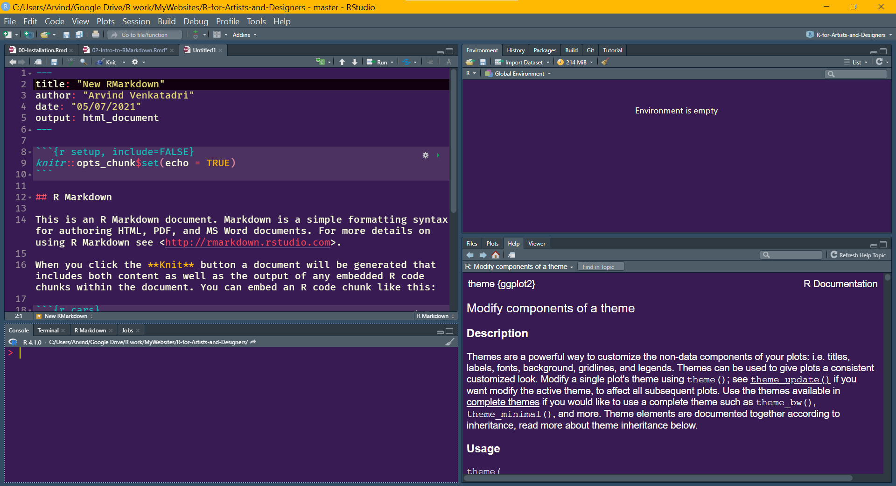
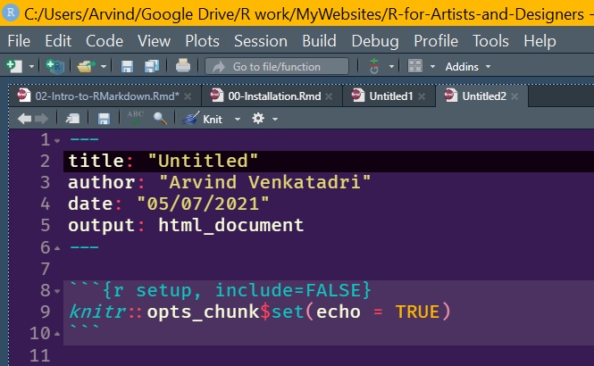
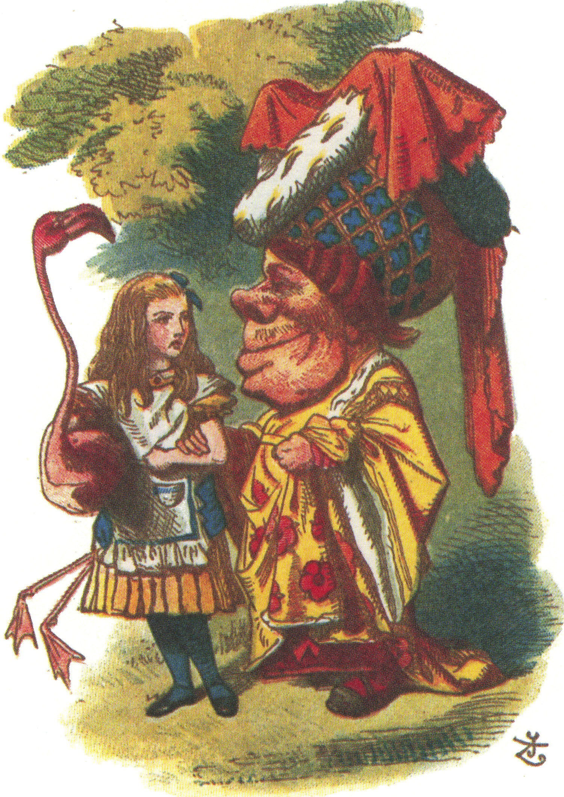

```{r setup, include=FALSE}
options(htmltools.dir.version = FALSE)
knitr::opts_chunk$set(fig.dim=c(4.8, 8), fig.retina=2, out.width="100%")
library(tidyverse)
library(knitr)
library(palmerpenguins)

# install.packages("devtools")
# devtools::install_github("hadley/emo")
library(emo)
library(emojifont) 
#https://cran.r-project.org/web/packages/emojifont/vignettes/emojifont.html
library(here)
here::set_here()
```

```{r xaringan-themer, include=FALSE, warning=FALSE}
library(xaringanthemer)
style_duo(primary_color = "#1F4257", secondary_color = "#F97B64",
  header_font_google = google_font("Josefin Sans"),
  text_font_google   = google_font("Montserrat", "300", "300i"),
  code_font_google   = google_font("Fira Mono")
)
```

name: title_slide
class: middle

# To ~~err~~ R is human

### Let's talk about what RMarkdown is all about !!


---

layout:true

# What is RMarkdown?

---

In an RMarkdown document:

- What you type in **text** becomes your *story*

- What you write as `code` makes your own **figures** 
`r emo::ji("bar_chart")`
    - code is written in ```fences``` with back-ticks

- You can link in:
    - pictures `r emo::ji("art")`
    - YT videos `r emo::ji("film_strip")` from the web

- Data / Code / Figures / Pictures / Document  **together** 

- In a document that "computes"

---


Click on the File -> RMarkdown

```{r echo=FALSE}

```

---

.pull-left[Edit the **YAML** header now. ( The stuff at the top between the three dashes)

- Name your file

- Write your name as author

- Change Date if you wish

SAVE.
]

.pull-right[
```{r echo=FALSE}

```

]

---
layout: true
# Editing your Markdown

---

- Everything is text
- Wrap Words in stars:
    - ```*italics*```: Single stars give you *italics*
    
    - ```**bold**```: Two stars give you **bold** text
    
    - ```***bold italic***```: Three stars ***bold italics***
    
    - ```~~deleted~~```: Tildes give you ~~deleted~~ text
---

- Hashes(`##`) become new Section Titles in text

- **Ctrl+Alt+I / CMD+Alt+I** give fenced code "chunks" which will "run". (Green "Play" button)
     - Hashes(`#`) inside code chunks give you new `#comments` in code
     
- "$mathstuff$": becomes $math stuff$ (Nooo...please! No!)

  - "$sin^2(x)+cos^2(x) = 1$": $sin^2(x)+cos^2(x) = 1$ (I think)
  
- "emo::ji("laugh")" becomes `r emo::ji("laugh")`

---

- All this done with `plain text`. 

- Just your keyboard and you. 

- Mouses and Touchpads are for....**(your favourite word of ridicule here)**.

---

layout: false
# Knitting your Markdown

Hitting the knit button `r emo::ji("knit")` does one of many things:

.pull-left[
Changes your plain text to:

- html `r emo::ji("web")`, or PDF `r emo::ji("file")` or Word `r emo::ji("document")`

- HTML webpage, or blog, or flexdashboards

- An interactive presentation like this one

- over 30 different output formats. 
]

.pull-right[
```{r echo=FALSE, height = "30px"}

```

]

---

class: center, middle
# OK, Where are we?

Are there any silent tears ? 

