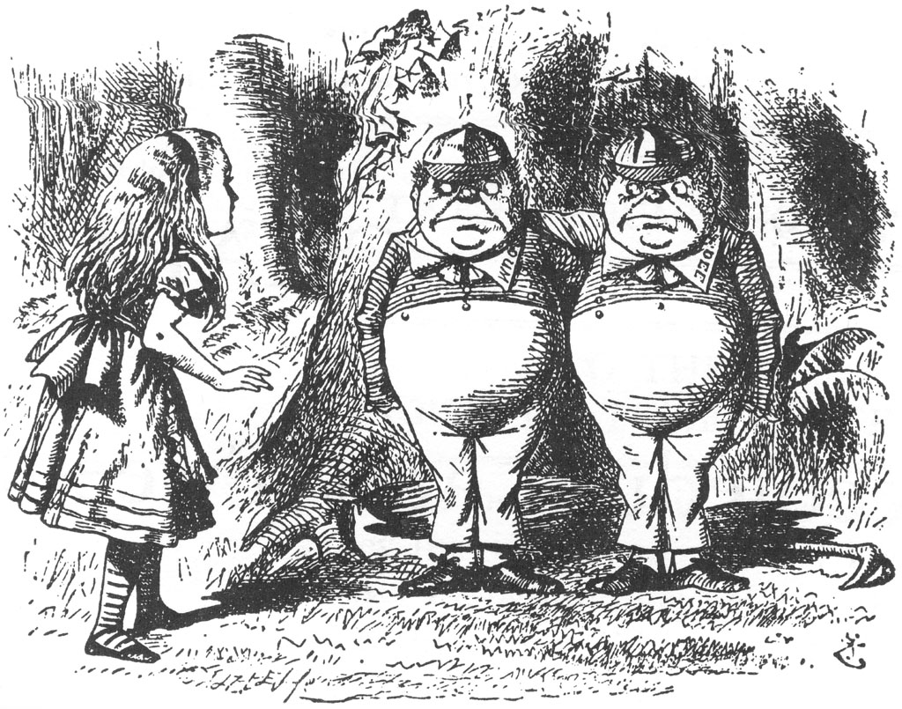

```{r setup, include=FALSE}
options(htmltools.dir.version = FALSE)
options(htmltools.dir.version = FALSE)
knitr::opts_chunk$set(warning = FALSE, message = FALSE, 
  comment = NA, dpi = 300,
  fig.align = "center", out.width = "65%", cache = FALSE)
library(xaringanthemer)
library(xaringanExtra)
library(tidyverse)
library(sf)
library(rnaturalearth)
library(rnaturalearthdata)
```

```{r xaringan-themer, include=FALSE, warning=FALSE}
library(xaringanthemer)
style_duo(primary_color = "#1F4257", secondary_color = "#F97B64",
  header_font_google = google_font("Josefin Sans"),
  text_font_google   = google_font("Montserrat", "300", "300i"),
  code_font_google   = google_font("Fira Mono"),
  text_bold_color = "#1E90FF"
)
# https://htmlcolorcodes.com/color-names/
```

```{r xaringanExtra, include=FALSE}
use_webcam()
use_fit_screen()
use_panelset()
```

layout: true
# Let's get started
---

Look at a piece of Google Map.

What different objects do you see?

What information do you think went into making it?

---

.pull-left[
- To make maps, we need data organized in a specific way

- Let us look at the pieces that go into making spatial data

- Our focus will be the r package `sf` ( "simple features")
]

.pull-right[
**Data Structure in `sf`**


]


The picture shows a familiar looking `data-frame` with the far-right column containing geometries....hmmm.

---
layout:false
## What is a Feature?

- A Thing, or an Object in the real world, such as a building or a tree. 
- As is the case with Objects, they often consist of other objects.  
- This is the case with features too: a set of features can form a single feature. 
- Examples of Features:  
-- A forest stand  
-- a city with building, streets, and parks  
-- A satellite image pixel   
-- a complete image can be a feature too.

-  A feature geometry is called **simple**  
  - when it consists of points connected by straight line pieces,  
  - and does not intersect itself.
---

## What is a Geometry?

- Features have a geometry describing where on Earth the feature is located  
- they have attributes, which describe other properties.  
- Examples:  
-- The geometry of a tree can be the delineation of its crown,  
-- of its stem,  
-- or the point indicating its centre.   

- Other properties may include its height, color, diameter at breast height at a particular date, species and so on.


---

## What is Geospatial Data?

.pull-left[

- Geospatial vector data consist of geometries defined based on geographic coordinates. 

- Geospatial Data describes **features** 

- Features are represented by any combination of these shapes ( And there are more shapes if you want them!!)

- And shows up in a special **geometry** column in the data

- Examples:  
-- Point: buildings, offices, venues, etc in a city  
-- LineString: Roads, rivers and railways  
-- Polygon: a lake, a golf course, or the border of a country  
-- MultiPolygon: Any non-contiguous set of areas  
]

.pull-right[

]
---
layout:true
## How are these shapes represented?
---

.pull-left[

]

.pull-right[


]
---

```{r highlight.output = c(4:5)}
nc <- st_read(system.file("shape/nc.shp", package="sf"))
```

```{r, echo=FALSE,highlight.output= c(11:13)}
head(nc, 3)
```

---
layout:false
## The `sf` : Spatial Data Frame: Point Geometry

.pull-left[

```{r plot1a, eval=FALSE, message=FALSE, warning = FALSE}
india <- 
  ne_states(country =  "india", 
            geounit = "india", 
            returnclass = "sf")
crs_india <- st_crs(india)
points <- 
  data.frame(lon = rnorm(5, 77, 2), 
             lat = rnorm(5, 23, 5)) %>% 
  st_as_sf(., coords = c("lon", "lat"),
           crs = crs_india)

str(points)

ggplot() + #<<
    geom_sf(data = india) + #<<
    geom_sf(data = points, colour = "red", size = 4) #<<

```
]

.pull-right[
```{r first-plot1a-out, ref.label='plot1a', echo=FALSE,message=FALSE,warning=FALSE, out.width ="90%", highlight.output = 2}
```
]

---

## The `sf`:Spatial Data Frame: Polygon Geometry

.pull-left[

```{r plot1b, eval=FALSE, message=FALSE,warning=FALSE}
# outer <- matrix(c(0,0,10,0,10,10,0,10,0,0) + c(77,23), 
#                ncol = 2, byrow = TRUE)
outer <- matrix(c(0,0,10,0,10,10,0,10,0,0) + c(77,23), ncol=2, byrow=TRUE)
hole1 <- matrix(c(1,1,1,2,2,2,2,1,1,1) + c(77,23),ncol=2, byrow=TRUE)
hole2 <- matrix(c(5,5,5,6,6,6,6,5,5,5) + c(77,23),ncol=2, byrow=TRUE)
pl1 <- list(outer, hole1, hole2)
pl1 <- st_polygon(pl1) %>% # feature geometry
  st_sfc() %>% # feature column
  st_as_sf(crs = crs_india) # spatial data frame
str(pl1)

ggplot() + #<<
    geom_sf(data = india) + #<<
    geom_sf(data = pl1, colour = "red") #<<
```
]

.pull-right[

```{r first-plot1b-out, ref.label='plot1b', echo=FALSE,message=FALSE,warning=FALSE, out.width ="90%", highlight.output = 2}
```

]


---
## The `sf`:Spatial Data Frame: Multi-Polygon Geometry

.pull-left[
```{r message=FALSE, warning=FALSE}
pol1 <-  list(outer, hole1, hole2)
pol2 <-  list(outer + 12, hole1 + 12)
pol3 <- list(outer - 12)
mp <-  list(pol1,pol2,pol3)

mp1 <- st_multipolygon(mp) %>% #feature geometry
  st_sfc() %>% #feature column
  st_as_sf(crs = crs_india) # sf dataframe
```

```{r plot1c, message=FALSE, eval=FALSE, warning=FALSE}
head(mp1,3)

ggplot() + #<<
    geom_sf(data = india) + #<<
    geom_sf(data = mp1, colour = "red") #<<

```
]

.pull-right[

```{r first-plot1c-out, ref.label='plot1c', echo=FALSE,message=FALSE,warning=FALSE, out.width ="90%", highlight.output = c(2,7)}
```

]


---
background-image: url("images/2book11.jpg")
background-position: 50% 50%
class: center, bottom, inverse
???
Image credit: [alice-in-wonderland.net](https://www.alice-in-wonderland.net/resources/background/tenniel-and-his-illustrations/)

---
## Map Projections: Through the Looking Glass


.pull-left[
{height=300px}
]
.pull-right[

We see Maps Through The Looking Glass..  
No Two Map Projections are Alike!
]

---
# A 2D Flat projection


---

---

class: inverse, center, middle
## Getting hold of Spatial Data

Using **osmdata**  
Using **rnaturalearth**  


---
layout:true
## Using `osmdata`
---

.pull-left[
lorem ipsum

]

.pull-right[
lorem ipsum
]
---

.pull-left[
lorem ipsum

]

.pull-right[
lorem ipsum
]

---
layout: true
## Using `rnaturalearth`


---

.pull-left[
lorem ipsum

]

.pull-right[
lorem ipsum
]

---

.pull-left[
lorem ipsum

]

.pull-right[
lorem ipsum
]

---
# Interactive Maps with `leaflet`
```{r out.width='100%', fig.height=6, eval=require('leaflet')}
library(leaflet)
leaflet() %>% addTiles() %>% setView(-93.65, 42.0285, zoom = 17)
```


---
class: center, middle

# Thanks!

Slides created by Arvind Venkatadri via the R packages:

[**xaringan**](https://github.com/yihui/xaringan)<br>

